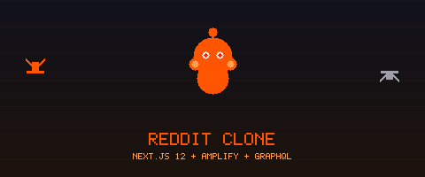

<div align="center">
  

  [](https://nextjs.org/)
  [](https://aws.amazon.com/amplify/)
  [](https://graphql.org/)
  [](https://mui.com/)

  **🤖 A full-stack Reddit clone — posts, votes, image uploads, and auth — built on Next.js 12 and AWS Amplify ⬆️**

</div>

---

> Built following the tutorial by [Jarrod Watts](https://www.youtube.com/watch?v=cLKLqpxPSws).

## ✨ Features

- 📝 **Create posts** with title, body, and optional image upload (AWS S3 via react-dropzone)
- ⬆️ **Vote on posts** — upvote and downvote
- 🔐 **User authentication** via AWS Cognito
- 📡 **GraphQL API** backed by AWS AppSync (real-time capable)
- 🗂️ **Feed view** — browse all posts sorted by votes

## 🚀 Quick Start

### Prerequisites

- AWS account
- Amplify CLI: `npm install -g @aws-amplify/cli`

### Setup

```bash
# Install dependencies
npm install

# Initialize Amplify project (follow the prompts)
amplify init

# Deploy backend (AppSync + Cognito + S3)
amplify push

# Run the app
npm run dev
```

## 🏗️ Backend (AWS Amplify)

| Service | Purpose |
|---|---|
| AWS AppSync | GraphQL API |
| AWS Cognito | User authentication |
| AWS S3 | Image storage |

The GraphQL schema lives in `amplify/backend/api/`.

## 🛠️ Tech Stack

- **Next.js 12**
- **AWS Amplify v4** — AppSync + Cognito + S3
- **MUI v5** — component library
- **react-hook-form** — form handling
- **react-dropzone** — drag-and-drop image upload
- **uuid** — unique post IDs
